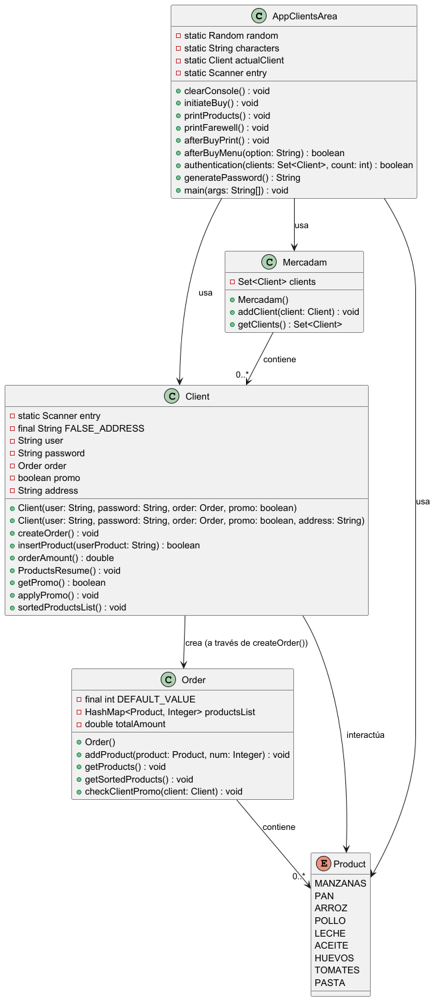

# Práctica: Servicio de compra online MERCADAM.

## Índice

1. [Resumen](#resumen)
2. [Estructura de Clases](#estructura-de-clases)
3. [Pruebas](#pruebas)
4. [Entrega](#entrega)

## Resumen.

> Este proyecto consiste en simular el funcionamiento de una app de compras online para un Supermercado ficticio llamado **MERCADAM**.

El programa estara dividido en dos partes:

- **App de gestion:** Para crear tanto los clientes como dar de alta productos.
- **App de zona de clientes:** autenticación , selección de productos y relación de pedidos.

## Estructura de clases.

> En este apartado estarán las referencias al código de las 
> propias clases y una breve explicación de cada método/función 
> de este. Puede ser tanto a nivel de código (comentarios) 
> como explicación externa de funcionamiento.

### Referencias a las clases **(documentadas)**:

- [App Clientes](https://github.com/NachoGamallo/ColeccionesDinamicasPFuncional/blob/main/PFuncional/src/main/java/org/example/Colecciones/P1Mercadam/Program/AppClientsArea.java)
- [MERCADAM](https://github.com/NachoGamallo/ColeccionesDinamicasPFuncional/blob/main/PFuncional/src/main/java/org/example/Colecciones/P1Mercadam/Program/Mercadam.java)
- [Clientes](https://github.com/NachoGamallo/ColeccionesDinamicasPFuncional/blob/main/PFuncional/src/main/java/org/example/Colecciones/P1Mercadam/Program/Client.java)
- [Ordenes](https://github.com/NachoGamallo/ColeccionesDinamicasPFuncional/blob/main/PFuncional/src/main/java/org/example/Colecciones/P1Mercadam/Program/Order.java)
- [Productos](https://github.com/NachoGamallo/ColeccionesDinamicasPFuncional/blob/main/PFuncional/src/main/java/org/example/Colecciones/P1Mercadam/Program/Product.java)
### Diagrama de Flujo del Programa:

## Pruebas.

Estas pruebas estarán **subidas a Youtube**, pincha en el enlace de abajo.
### [Enlace Vídeo]()

## Entrega.

> Con este documento se tiene acceso tanto al 
> código de la app, las pruebas realizadas para
> esta y una explicación de el funcionamiento a nivel
> técnico. 
